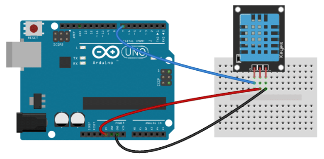

# Temperatur / fugtighed sensor
### Arduino Uno R3 med temp / fugt sensor (DHT11 modul), samt et LCD 1602A til at vise det på.

 Opgaven er til eget forbrug, til tjekmåling af temperatur / fugtighed i et specifikt rum i huset. 
udover det, er det en god øvelse da LCD 1602 kræver en hel del ledsningsopsætning for at fungere korrekt. 

 <b>Billede af projektet:</b> 

### Til projektet er der benyttet følgende:

* 19 stk. han/han kabler.
* 1 DHT 11 (3 pins) 
* 1 10k potentiometer
* 1 LCD 1602A display
* 1 stk. Arduino UNO R3 

 <b>Kabelføring for LCD1602A til Arduino med potentiometer:</b> 

 <b>Kabelføring for DHT11 til Arduino:</b> 

